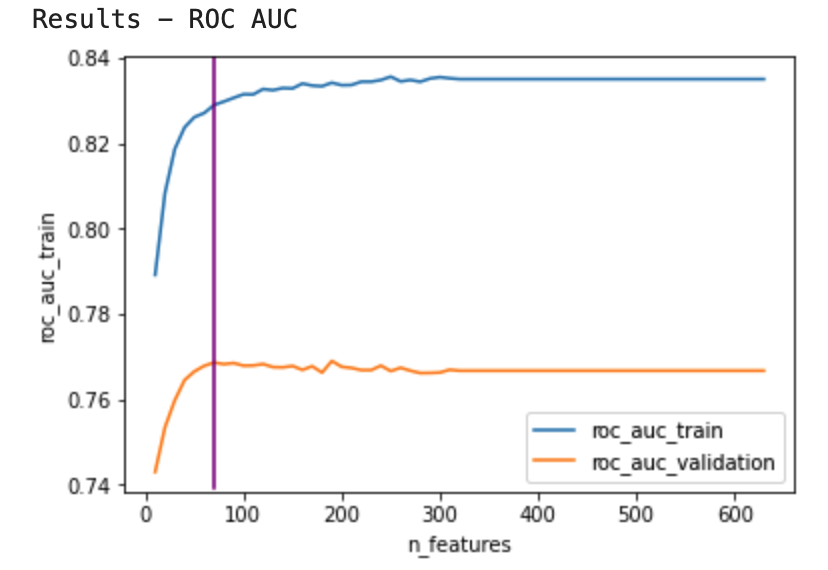
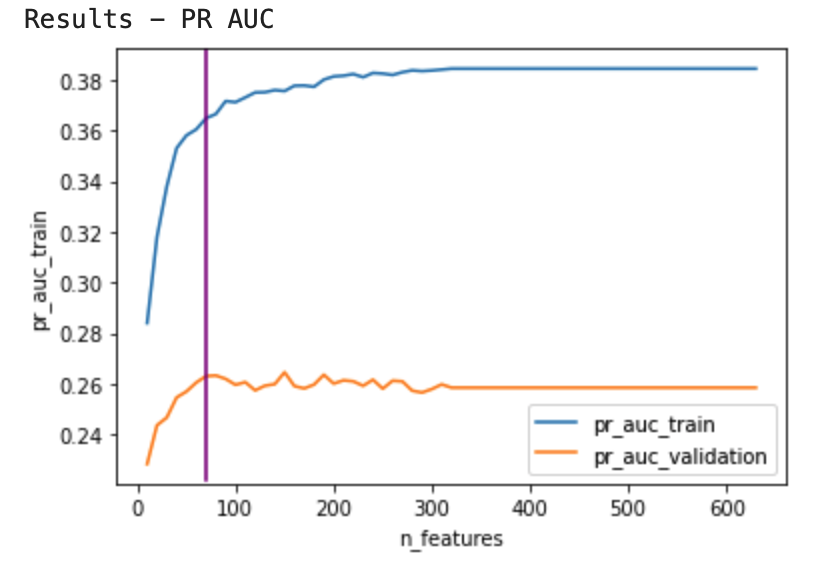

# Home Credit Default Risk
Note: This data is provided by Home Credit, which hosted a competition on Kaggle (https://www.kaggle.com/competitions/home-credit-default-risk/overview) to see what models the machine learning community can develop to help them in this task.

The main objective of this exercise is to build a classifier to estimate the ability of applicants to repay the loan on time. This classifier seeks to make the credit application process a winning situation for both the client and the company. If an applicant is found to be in a position to repay a loan, their application is accepted, and if not, their application is denied. On the one hand, this will ensure that applicants who can afford the loan will not have their applications rejected. On the other hand, it mitigates the company's loss from non-payment by approving applicants who cannot pay.

To build the model, I followed these steps:
1. Business Understanding: This phase focuses on understanding the project goal and requirements from a business perspective and then converting this knowledge into a data science problem definition.
2. Data preparation and understanding: Prepare the data set and perform an exploratory analysis of the different characteristics/attributes to gather information about the data.
3. Featuring Engineering
4. Modeling: Build a classifier and training algorithm using the train data.
5. Evaluation: Evaluate the performance of the model on unseen data.
6. Definition of business rules: Using the model score, define thresholds on unknown data to make decisions.
   
Finally, to make the model easily accessible, scalable, reproducible, and collaborative, I built an ML pipeline, which covers all the necessary steps to get a prediction from the data, from data processes to prediction acquisition. 

## 1. Business understanding
The objective variable of this problem is to estimate the probability that the applicants can pay the loan on time. To address this problem, I built a binary classification model. I used a sample of requests associated with their respective label indicating whether the loan was repaid or the loan was not repaid. In addition, I used a subset of information on the characteristics of the requested credit and the client, such as their historical credit behavior. Finally, I used the predicted score for each application that the model returns to make decisions.
To define how this probability will be used is necessary to determine the business objectives:
* Option 1: We want business rules focused on maximizing the ability to identify bad applicants. But the number of mislabels on good applicants increases (false positive rate). With this approach, we would minimize the credit risk but increase the users' friction by rejecting that they can pay the loan.

* Option 2: We want a business rule where we would minimize the number of mislabels on good applicants (false positive rate). But the ability to identify bad applicants decreases. With this approach, we would minimize the users' friction but increase the credit risk by approving that they cannot pay the loan.

On the other hand, to choose the structure of the model and evaluate its performance, I will seek to maximize the ROC AUC. This metric is more related to the evaluation of classifiers based on their efficiency for class separation. We can isolate the modeling process by maximizing accuracy and recovery metrics for different probability thresholds and use score for decision-making. With this, we can choose the threshold that best suits the needs of the business to define whether an application is highly successful or not.

Additionally, one of the characteristics of this problem is the not repaid loan sample is much higher than the repaid loan sample. Therefore, the Precision-Recall AUC (PR AUC) will also be evaluated, which is a more robust metric to evaluate a classifier in these situations to deal with class imbalance.

## 2. Data preparation and understanding

There are seven different sources of data:

In this phase, I did the following analysis: 
	a. The target variable
	b. Variable types (categorical and numerical)
 	c. Missing data
	d. Numerical variables
	e. Categorical variables
	f. Correlations

The insights more relevant in this phase were:
- The dataset is very unbalanced. The positive class, not repaid loan, represents approximately 8.07% of all transactions. 

- The number of variable with null values is approximately 54.92% of all variables. 

- From the distribution of age, we can infer that as the client gets older, they tend to repay their loans on time more often.

- The 3 variables EXT_SOURCE_1, EXT_SOURCE_2 and EXT_SOURCE_3 show a greater difference between the values of the target. According to the documentation, these features represent a "normalized score from an external data source".
  
    #### More details in Notebook:  1. Machine Learning Pipeline - Home Credit Default Risk: Data preparation and understanding

## 3. Featuring Engineering

I created new variables by calculating statistics on the historical information of the clients' credit behavior, such as the average, max, min, and sum. With this, I passed from a data frame of 116 features to one of around 600.

#### More details in Notebook:  2. Machine Learning Pipeline - Home Credit Default Risk: Feature Engineering

## 4. Modeling
### a. Train baseline model

I trained a base logit regression as a benchmark to measure future progress when applying feature selection and hyperparameter tuning. The results were the following:
        
  - ROC AUC Train: 75.97%
  - ROC AUC Validation: 75.11%
  - PR AUC Train: 23.95%
  - PR AUC Validation: 23.1%

### b. Train other models

    - Random Forest 
        - ROC AUC Train: 100.0%
        - ROC AUC Validation: 70.1%
        - PR AUC Train: 100.0%
        - PR AUC Validation: 19.3%

    - LightGBM
        - ROC AUC Train: 83.5%
        - ROC AUC Validation: 76.67%
        - PR AUC Train: 38.44%
        - PR AUC Validation: 25.8%

Finally, I chose the lightgbm because this model had the highest ROC AUC among the three tested models. Also, this model can deal with null values in the features, and its performance is not affected by the magnitudes of the feature values.

### c. Forward Feature selection
- Get Feature Importance from Shap Values
  
  - Choose the number of features.
  
  
The number of features that optimize the performance of the model is 80.

### d. Hyperparameter Tuning
The following LightGBM hyperparameters were chosen to optimize:
- learning_rate
- num_estimators
- num_leaves
- max_depth
- min_data_in_leaf
- bagging_fraction
- feature_fraction

The best iteration That I got was the following definition:
- number_feature: 70
- model_parameters: 
  - num_estimators: 142
  - learning_rate': 0.1261689397241983
  - num_leaves: 36
  - max_depth: 375
  - min_data_in_leaf: 69
  - bagging_fraction: 0.7812134356069105
  - feature_fraction: 0.6116389811545921
   
 With the following results: 
  - ROC AUC Train: 86.02%
  - ROC AUC Validation: 76.73%
  - PR AUC Train: 37.32%
  - PR AUC Validation: 26.21%

#### More details in Notebook:  3. Machine Learning Pipeline - Home Credit Default Risk: Modeling and Evaluation

## 5. Evaluation on Test Dataset

Final Model:
- number_feature: 70
- model_parameters: 
  - num_estimators: 142
  - learning_rate': 0.1261689397241983
  - num_leaves: 36
  - max_depth: 375
  - min_data_in_leaf: 69
  - bagging_fraction: 0.7812134356069105
  - feature_fraction: 0.6116389811545921
		
 With the following results: 
  - ROC AUC Train: 85.4%
  - ROC AUC Validation: 77.82%
  - PR AUC Train: 36.07%
  - PR AUC Validation: 26.81%

#### More details in Notebook:  3. Machine Learning Pipeline - Home Credit Default Risk: Modeling and Evaluation

## 6. Definition of business rules

Finally, the final decision system based on the predictions of the model must be adequately balanced to identify customers who cannot repay the credit without the system being too strict and incorrectly rejecting those who can pay, affecting the customer experience. Therefore, to decide whether or not to deny a loan, we can use a customer's credit default score assigned by the model and define several thresholds to act based on where that score is.

To increase the default identification rate and ensure a smooth experience for most customers, we defined the following business rules:

- Extreme risk: This rule seeks to correctly identify customers who cannot pay the credit with a very low rate of false positives. Requests identified by this rule may be automatically rejected. Therefore, a false positive rate of less than 5% will be allowed. This rate corresponds to requests whose score is between 0.77 and 1.0.

- High risk: This rule seeks to identify more customers who cannot pay, assuming a higher rate of false positives. The false positive rate tolerance level for this rule equals 20%, and this rate corresponds to requests whose score is between 0.57 and 0.77. But as the number of mislabeled good customers identified by the model increases, customers who fall into this segment must manually go through a more extensive review before being denied.

- Low risk: Applications with a score lower than 0.57 can be automatically approved.

Based on the set of tests, the number of clients that the model identifies as a potential risk of non-repayment is evaluated, that is, those whose score is greater than 0.57. 
The following results are obtained: 
- Accuracy: 79.12%.
- Recall rate: 58.19%.
- Percentage Amount of credit risk detected: 54.76%
